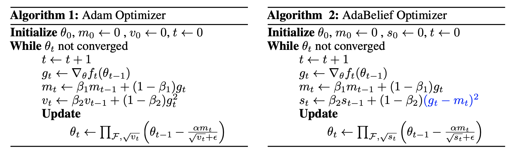
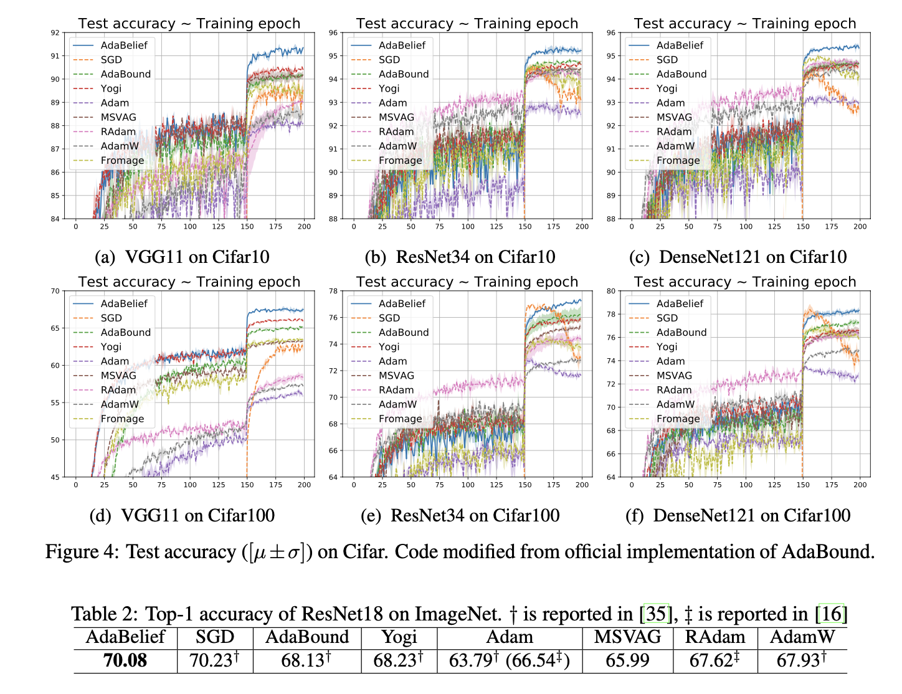
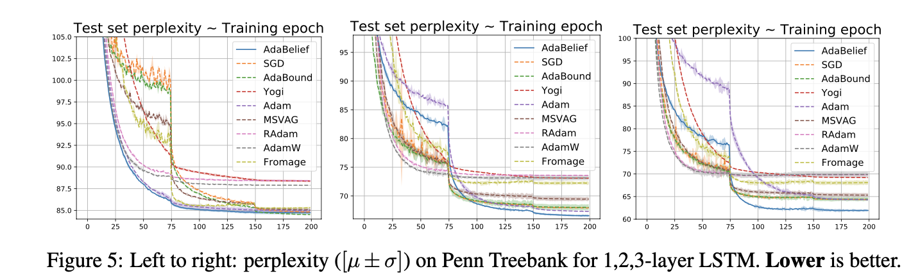

<h1 align="center">AdaBelief Optimizer</h1>
<h3 align="center">NeurIPS 2020 Spotlight, trains fast as Adam, generalizes well as SGD, and is stable to train GANs.</h3>

## Table of Contents
- [External Links](#external-links)
- [Installation and usage](#Installation-and-usage)
- [A quick look at the algorithm](#a-quick-look-at-the-algorithm)
- [Discussions (IMPORTANT, please read before using)](#Discussions)
- [Reproduce results in the paper ](#Reproduce-results-in-the-paper)
- [Citation](#citation)

## External Links
<a href="https://juntang-zhuang.github.io/adabelief/"> Project Page</a>, <a href="https://arxiv.org/abs/2010.07468"> arXiv </a>, <a href="https://www.reddit.com/r/MachineLearning/comments/jc1fp2/r_neurips_2020_spotlight_adabelief_optimizer">Reddit </a>, <a href="https://twitter.com/JuntangZhuang/status/1316934184607354891">Twitter</a>

## Installation and usage

### 1. PyTorch implementations
#### AdaBelief
```
pip install adabelief-pytorch
```
```
from adabelief_pytorch import AdaBelief
optimizer = AdaBelief(model.parameters(), lr=1e-3, eps=1e-12, betas=(0.9,0.999))
```
#### Adabelief with Ranger optimizer
```
pip install ranger-adabelief
```
```
from ranger_adabelief import RangerAdaBelief
optimizer = RangerAdaBelief(model.parameters(), lr=1e-3, eps=1e-12, betas=(0.9,0.999))
```
### 2. Tensorflow implementation
```
pip install adabelief-tf
```
```
from adabelief_tf impoty AdaBeliefOptimizer
optimizer = AdaBeliefOptimizer(learning_rate, epsilon=1e-12) 
```

## A quick look at the algorithm
<h2>Algorithm</h2>
        <hr>
        
        <div>
            Adam and AdaBelief are summarized in Algo.1 and Algo.2, where all operations are 
            element-wise, with differences marked in blue. Note that no extra parameters are introduced in AdaBelief. For simplicity,
             we omit the bias correction step. Specifically, in Adam, the update 
             direction is \( m_t/\sqrt{v_t} \), where \(v_t\) is the EMA of \(g_t^2\); in AdaBelief, the update direction is \(m_t/\sqrt{s_t}\),
              where \(s_t\) is the EMA (Exponential Moving Average) of \( (g_t - m_t)^2 \). Intuitively, viewing \( m_t \) as the prediction of \( g_t \), AdaBelief takes a 
              large step when observation \( g_t \) is close to prediction m_t, and a small step when the observation greatly deviates
               from the prediction.
        </div>
        
## Reproduce results in the paper 
#### (Comparison with 8 other optimizers: SGD, Adam, AdaBound, RAdam, AdamW, Yogi, MSVAG, Fromage)
See folder ``PyTorch_Experiments``, for each subfolder, execute ```sh run.sh```. See  ```readme.txt``` in each subfolder for visualization, or
refer to jupyter notebook for visualization.

### Results on Image Recongnition 
<p align="center">
 
</p>

### Results on GAN training
<p align="center">

</p>

### Results on LSTM
<p align="center">

</p>

### Results on Toy Example
<p align="center">

</p>

## Discussions

#### Installation
Please instal the latest version from pip, old versions might suffer from bugs. Source code for up-to-date package is available in folder ```pypi_packages```. 
#### Discussion on algorithms
##### 1. Weight Decay: 
- Decoupling (argument ```weight_decouple (default:False)``` appears in ```AdaBelief``` and ```RangerAdaBelief```): <br>
   Currently there are two ways to perform weight decay for adaptive optimizers, directly apply it to the gradient (Adam), or ```decouple``` weight decay from gradient descent (AdamW). This is passed to the optimizer by argument ```weight_decouple (default: False)```.

- Fixed ratio (argument ```fixed_decay (default: False)``` appears in ```AdaBelief```): <br>
   (1) If ```weight_decouple == False```, then this argument does not affect optimization. <br>
   (2) If ```weight_decouple == True```: <br>
        <ul>  If ```fixed_decay == False```, the weight is multiplied by ``` 1 -lr x weight_decay``` </ul> 
        <ul>  If ```fixed_decay == True```, the weight is multiplied by ```1 - weight_decay```. This is implemented as an option but not used to produce results in the paper. </ul>

- What is the acutal weight-decay we are using? <br>
   This is seldom discussed in the literature, but personally I think it's very important. When we set ```weight_decay=1e-4``` for SGD, the weight is scaled by ```1 - lr x weight_decay```. Two points need to be emphasized: (1) ```lr``` in SGD is typically larger than Adam (0.1 vs 0.001), so the weight decay in Adam needs to be set as a larger number to compensate. (2) ```lr``` decays, this means typically we use a larger weight decay in early phases, and use a small weight decay in late phases.

##### 2. Epsilon:
AdaBelief seems to require a different ```epsilon``` from Adam. In CV tasks in this paper, ```epsilon``` is set as ```1e-8```. For GAN training and LSTM, it's set as ```1e-12```. We recommend try different ```epsilon``` values in practice, and sweep through a large region, e.g. ```1e-8, 1e-10, 1e-12, 1e-14, 1e-16, 1e-18```. Typically a smaller ```epsilon``` makes it more adaptive.

##### 3. Rectify (argument ```rectify (default: False)``` in ```AdaBelief```):
Whether to turn on the rectification as in RAdam. The recitification basically uses SGD in early phases for warmup, then switch to Adam. Rectification is implemented as an option, but is never used to produce results in the paper.

##### 4. AMSgrad (argument ```amsgrad (default: False)``` in ```AdaBelief```):
Whether to take the max (over history) of denominator, same as AMSGrad. It's set as False for all experiments.

##### 5. Details to reproduce results
* Results in the paper are generated using the PyTorch implementation in ```adabelief-pytorch``` package. This is the __ONLY__ package that I have extensively tested for now. <br>

|   Task   | beta1 | beta2 | epsilon | weight_decay | weight_decouple | fixed_decay | rectify | amsgrad |
|:--------:|-------|-------|---------|--------------|-----------------|-------------|---------|---------|
| Cifar    | 0.9   | 0.999 | 1e-8    | 5e-4         | False           | False       | False   | False   |
| ImageNet | 0.9   | 0.999 | 1e-8    | 1e-2         | True            | False       | False   | False   |
| GAN      | 0.5   | 0.999 | 1e-12   | 0            | False           | False       | False   | False   |

* We also provide a modification of ```ranger``` optimizer in ```ranger-adavelief``` which combines ```RAdam + LookAhead + Gradient Centralization + AdaBelief```, but this is not used in the paper and is not extensively tested. 
* The ```adabelief-tf``` is a naive implementation in Tensorflow. It lacks many features such as ```decoupled weight decay```, and is not extensively tested. Currently I don't have plans to improve it since I seldom use Tensorflow, please contact me if you want to collaborate and improve it.

##### 6. Contact
Please contact me at ```j.zhuang@yale.edu``` or open an issue here if you would like to help improve it, especially the tensorflow version, or explore combination with other methods, some discussion on the theory part, or combination with other methods to create a better optimizer. Any thoughts are welcome!

## Citation
```
@article{zhuang2020adabelief,
  title={AdaBelief Optimizer: Adapting Stepsizes by the Belief in Observed Gradients},
  author={Zhuang, Juntang and Tang, Tommy and Tatikonda, Sekhar and and Dvornek, Nicha and Ding, Yifan and Papademetris, Xenophon and Duncan, James},
  journal={Conference on Neural Information Processing Systems},
  year={2020}
}
```
