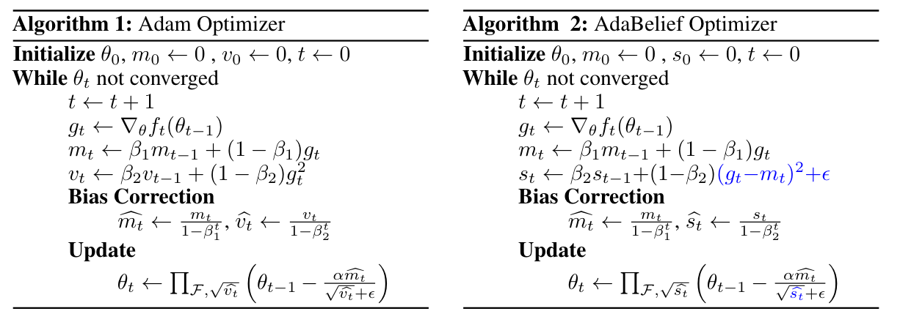
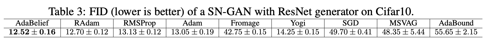
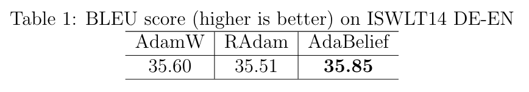

<h1 align="center">AdaBelief Optimizer</h1>
<h3 align="center">NeurIPS 2020 Spotlight, trains fast as Adam, generalizes well as SGD, and is stable to train GANs.</h3>

## Table of Contents
- [External Links](#external-links)
- [Link to extra experiments](#link-to-code-for-extra-experiments-with-adabelief)
- [Table of hyper-parameters](#table-of-hyper-parameters)
- [Quick Guide](#quick-guide) Important infomation on hyper-params.
- [Installation and usage](#Installation-and-usage)
- [A quick look at the algorithm](#a-quick-look-at-the-algorithm)
- [Detailed Discussions](#Discussions) 
- [Reproduce results in the paper ](#Reproduce-results-in-the-paper)
- [Update Plan](#update-plan)
- [Citation](#citation)

## External Links
<a href="https://juntang-zhuang.github.io/adabelief/"> Project Page</a>, <a href="https://arxiv.org/abs/2010.07468"> arXiv </a>, <a href="https://www.reddit.com/r/MachineLearning/comments/jc1fp2/r_neurips_2020_spotlight_adabelief_optimizer">Reddit </a>, <a href="https://twitter.com/JuntangZhuang/status/1316934184607354891">Twitter</a>

## Link to code for extra experiments with AdaBelief
* SN-GAN https://github.com/juntang-zhuang/SNGAN-AdaBelief <br>
* Transformer (PyTorch 1.1) https://github.com/juntang-zhuang/transformer-adabelief <br>
* Transformer (PyTorch 1.6) https://github.com/juntang-zhuang/fairseq-adabelief <br>
* Reinforcement Learning (Toy) https://github.com/juntang-zhuang/rainbow-adabelief <br>
* Object detection (by yuanwei2019) https://github.com/yuanwei2019/EAdam-optimizer (Note that this version uses ```adabelief-pytorch==0.0.5```, and the default hyper-parameters is different from ```adabelief-pytorch==0.1.0```. Please check your version of adabelief, and whether you specify all hyper-parameters, or does the default is what you want.) <br>
* [Text classification](https://colab.research.google.com/drive/1wx-c5SRPLBomW9YNRvlOqoHy5aycV4lK?usp=sharing) and [word embedding](https://colab.research.google.com/drive/14N9SpP4OiDsGacASWXsTM44FfK5KU-jM?usp=sharing) in Tensorflow <br>

## Update for ```adabelief-pytorch==0.1.0``` (Crucial)
In the next release of ```adabelief-pytorch```, we will modify the default of several arguments, in order to fit the needs of for general tasks such as GAN and Transformer. Please check if you specify these arguments or use the default when upgrade from version 0.0.5 to higher.

|   Version| epsilon | weight_decouple | rectify     | 
|:--------:|---------|-----------------|-------------|
|   adabelief-pytorch=0.0.5 |   1e-8  |   False         |   False     |
|   latest version 0.1.0>0.0.5|    1e-16 |    True         |    True     |

## Update for ```adabelief-tf==0.1.0``` (Crucial)
In ```adabelief-tf==0.1.0```, we modify ```adabelief-tf``` to have the same feature as ```adabelief-pytorch```, inlcuding decoupled weight decay and learning rate rectification. Furthermore, we will add support for TensorFlow>=2.0 and Keras. The source code is in ```pypi_packages/adabelief_tf0.1.0```. We tested with a [text classification task](https://colab.research.google.com/drive/1wx-c5SRPLBomW9YNRvlOqoHy5aycV4lK?usp=sharing) and a [word embedding task](https://colab.research.google.com/drive/14N9SpP4OiDsGacASWXsTM44FfK5KU-jM?usp=sharing). 
The default value is updated, please check if you specify these arguments or use the default when upgrade from version 0.0.1 to higher.:
|   Version| epsilon | weight_decouple | rectify     | 
|:--------:|---------|-----------------|-------------|
|   adabelief-tf=0.0.1 |   1e-8  |   Not supported         |   Not supported     |
|   latest version 0.1.0>0.0.1|    1e-14 |    Supported         |    default: True     |

## Quick Guide

* Check if the code is from the latest official implementation (adabelief-pytorch==0.1.0, adabelief-tf==0.1.0)
      Default hyper-parameters are different from the old version.

* In your experiment,

     >Epsilon in AdaBelief is different from Adam (typically eps_adabelief = eps_adam*eps_adam) <br>
     >( eps of Adam in Tensorflow is 1e-7, in PyTorch is 1e-8, need to consider this when use AdaBelief in Tensorflow) <br>
     
     >> If SGD is better than Adam   ->  Set a large eps (1e-8) in AdaBelief-pytorch (1e-7 in Tensorflow <br>
     >> If SGD is worse than Adam   ->  Set a small eps (1e-16) in AdaBelief-pytorch (1e-14 in Tensorflow, rectify=True often helps) <br>
     >> If AdamW is better than Adam   ->   Turn on “weight_decouple”  in AdaBelief-pytorch (this is on in adabelief-tf==0.1.0 and cannot shut down) <br>

* Check ALL hyper-parameters. Refer to our github page for a list of recommended hyper-parameters

## Table of Hyper-parameters 
### Please check if you have specify all arguments and check your version is latest, the default might not be suitable for different tasks, see tables below
### Hyper-parameters in PyTorch
|   Task   |  lr | beta1 | beta2 | epsilon | weight_decay | weight_decouple | rectify     | fixed_decay | amsgrad |
|:--------:|-----|-------|-------|---------|--------------|-----------------|-------------|---------|---------|
| Cifar    | 1e-3 | 0.9   | 0.999 | 1e-8    | 5e-4         | False           | False      | False   | False   |
| ImageNet | 1e-3 |0.9   | 0.999 | 1e-8    | 1e-2         | True            | False       | False   | False   |
| Object detection (PASCAL) | 1e-4 | 0.9   | 0.999 | 1e-8    | 1e-4         | False           | False      | False   | False   |
| LSTM-1layer| 1e-3| 0.9 | 0.999 | 1e-16   | 1.2e-6        | False           | False      | False   | False   |
| LSTm 2,3 layer|1e-2| 0.9| 0.999 | 1e-12 |  1.2e-6.       | False           | False      | False   | False   |
| GAN  (small)| 2e-4 |0.5| 0.999 | 1e-12   | 0            | True=False (decay=0)| False   | False   | False   |
| SN-GAN (large)|2e-4 | 0.5   | 0.999 | 1e-16   | 0     | True=False (decay=0)| True      | False   | False   |
| Transformer| 5e-4| 0.9 | 0.999  | 1e-16   | 1e-4         | True            | True      | False   | False   |
| Reinforcement (Rainbow)| 1e-4 | 0.9 | 0.999 | 1e-10|     0.0           | True=False (decay=0)| True   | False   | False   |
| Reinforcement (HalfCheetah-v2)| 1e-3 | 0.9 | 0.999 | 1e-16|     0.0           | True=False (decay=0)| True   | False   | False   |


### Hyper-parameters in Tensorflow (eps in Tensorflow might need to be larger than in PyTorch)
```epsilon``` is used in a different way in Tensorflow (default 1e-7) compared to PyTorch (default 1e-8), so eps in Tensorflow might needs to be larger than in PyTorch (perhaps 100 times larger in Tensorflow, e.g.  eps=1e-16 in PyTorch v.s eps=1e-14 in Tensorflow). But personally I don't have much experience with Tensorflow, it's likely that you need to slightly tune eps.

## Installation and usage

### 1. PyTorch implementations
（ Results in the paper are all generated using the PyTorch implementation in ```adabelief-pytorch``` package, which is the __ONLY__ package that I have extensively tested for now.) <br>

#### AdaBelief
Please install latest version (0.1.0), previous version (0.0.5) uses different default arguments.
```
pip install adabelief-pytorch==0.1.0
```
```
from adabelief_pytorch import AdaBelief
optimizer = AdaBelief(model.parameters(), lr=1e-3, eps=1e-16, betas=(0.9,0.999), weight_decouple = True, rectify = False)
```
#### Adabelief with Ranger optimizer
```
pip install ranger-adabelief==0.1.0
```
```
from ranger_adabelief import RangerAdaBelief
optimizer = RangerAdaBelief(model.parameters(), lr=1e-3, eps=1e-12, betas=(0.9,0.999))
```
### 2. Tensorflow implementation (eps of AdaBelief in Tensorflow is larger than in PyTorch, same for Adam)
Current tensorflow implementation is imcomplete, and does not support decoupled weight decay and rectification. Will update in release 0.1.0
```
pip install adabelief-tf==0.1.0
```
```
from adabelief_tf import AdaBeliefOptimizer
optimizer = AdaBeliefOptimizer(learning_rate=1e-3, epsilon=1e-14, rectify=False)
```

<h2>A quick look at the algorithm</h2>
        <p align='center'>
         </p>
        <div>
            Adam and AdaBelief are summarized in Algo.1 and Algo.2, where all operations are 
            element-wise, with differences marked in blue. Note that no extra parameters are introduced in AdaBelief. For simplicity,
             we omit the bias correction step. Specifically, in Adam, the update 
             direction is   , where  is the EMA (Exponential Moving Average) of ; in AdaBelief, the update direction is ,
              where  is the of . Intuitively, viewing  as the prediction of , AdaBelief takes a 
              large step when observation  is close to prediction , and a small step when the observation greatly deviates
               from the prediction.
        </div>

## Reproduce results in the paper 
#### (Comparison with 8 other optimizers: SGD, Adam, AdaBound, RAdam, AdamW, Yogi, MSVAG, Fromage)
See folder ``PyTorch_Experiments``, for each subfolder, execute ```sh run.sh```. See  ```readme.txt``` in each subfolder for visualization, or
refer to jupyter notebook for visualization.

### Results on Image Recongnition 
<p align="center">
 
</p>

### Results on GAN training
#### Results on a small GAN with vanilla CNN generator
<p align="center">

</p>

#### Results on Spectral Normalization GAN with a ResNet generator
<p align="center">

</p>

### Results on LSTM
<p align="center">

</p>

### Results on Transformer
<p align="center">

</p>

### Results on Toy Example
<p align="center">

</p>

## Discussions

#### Installation
Please install the latest version from pip, old versions might suffer from bugs. Source code for up-to-date package is available in folder ```pypi_packages```. 

#### Discussion on hyper-parameters
AdaBelief uses a different denominator from Adam, and is orthogonal to other techniques such as recification, decoupled weight decay, weight averaging et.al.
This implies when you use some techniques with Adam, to get a good result with AdaBelief you might still need those techniques.

* ```epsilon``` in AdaBelief plays a different role as in Adam, typically when you use ```epslison=x``` in Adam, using ```epsilon=x*x``` will give similar results in AdaBelief. The default value ```epsilon=1e-8``` is not a good option in many cases, will modify it later to 1e-12 or 1e-16 later.

* If you task needs a "non-adaptive" optimizer, which means SGD performs much better than Adam(W), such as on image recognition, you need to set a large ```epsilon```(e.g. 1e-8,1e-10) for AdaBelief to make it more ```non-adaptive```; if your task needs a really ```adaptive``` optimizer, which means Adam is much better than SGD, such as GAN, then the recommended ```epsilon``` for AdaBelief is small (1e-12, 1e-16 ...).

* If decoupled weight decay is very important for your task, which means AdamW is much better than Adam, then you need to set ```weight_decouple``` as True to turn on decoupled decay in AdaBelief. Note that many optimizers uses decoupled weight decay without specifying it as an options, e.g. RAdam, but we provide it as an option so users are aware of what technique is actually used.

* Don't use "gradient threshold" (clamp each element independently) in AdaBelief, it could result in division by 0 and explosion in update; but "gradient clip" (shrink amplitude of the gradient vector but keeps its direction) is fine, though from my limited experience sometimes the clip range needs to be the same or larger than Adam.

* Settings to reproduce results in this repository. Note that ```epsilon``` and ```rectify``` are quite important, and vary with tasks. For scenario where "adaptivity" is crucial, such as SN-GAN and Transformer, use a small ```epsilon``` (1e-12 or 1e-16), and turn on ```rectify```.

#### Discussion on algorithms
##### 1. Weight Decay: 
- Decoupling (argument ```weight_decouple ``` appears in ```AdaBelief``` and ```RangerAdaBelief```): <br>
   Currently there are two ways to perform weight decay for adaptive optimizers, directly apply it to the gradient (Adam), or ```decouple``` weight decay from gradient descent (AdamW). This is passed to the optimizer by argument ```weight_decouple (default: False)```.

- Fixed ratio (argument ```fixed_decay (default: False)``` appears in ```AdaBelief```): <br>
   (1) If ```weight_decouple == False```, then this argument does not affect optimization. <br>
   (2) If ```weight_decouple == True```: <br>
        <ul>  If ```fixed_decay == False```, the weight is multiplied by ``` 1 -lr x weight_decay``` </ul> 
        <ul>  If ```fixed_decay == True```, the weight is multiplied by ```1 - weight_decay```. This is implemented as an option but not used to produce results in the paper. </ul>

- What is the acutal weight-decay we are using? <br>
   This is seldom discussed in the literature, but personally I think it's very important. When we set ```weight_decay=1e-4``` for SGD, the weight is scaled by ```1 - lr x weight_decay```. Two points need to be emphasized: (1) ```lr``` in SGD is typically larger than Adam (0.1 vs 0.001), so the weight decay in Adam needs to be set as a larger number to compensate. (2) ```lr``` decays, this means typically we use a larger weight decay in early phases, and use a small weight decay in late phases.

##### 2. Epsilon:
AdaBelief seems to require a different ```epsilon``` from Adam. In CV tasks in this paper, ```epsilon``` is set as ```1e-8```. For GAN training and LSTM, it's set as ```1e-12```. We recommend try different ```epsilon``` values in practice, and sweep through a large region, e.g. ```1e-8, 1e-10, 1e-12, 1e-14, 1e-16, 1e-18```. Typically a smaller ```epsilon``` makes it more adaptive.

##### 3. Rectify (argument ```rectify``` in ```AdaBelief```):
Whether to turn on the rectification as in RAdam. The recitification basically uses SGD in early phases for warmup, then switch to Adam. Rectification is implemented as an option, but is never used to produce results in the paper.

##### 4. AMSgrad (argument ```amsgrad (default: False)``` in ```AdaBelief```):
Whether to take the max (over history) of denominator, same as AMSGrad. It's set as False for all experiments.

##### 5. Details to reproduce results
* Results in the paper are generated using the PyTorch implementation in ```adabelief-pytorch``` package. This is the __ONLY__ package that I have extensively tested for now. <br>
* We also provide a modification of ```ranger``` optimizer in ```ranger-adabelief``` which combines ```RAdam + LookAhead + Gradient Centralization + AdaBelief```, but this is not used in the paper and is not extensively tested. 
* <del> The ```adabelief-tf``` is a naive implementation in Tensorflow. It lacks many features such as ```decoupled weight decay```, and is not extensively tested. Currently I don't have plans to improve it since I seldom use Tensorflow, please contact me if you want to collaborate and improve it.</del>
* The ```adabelief-tf==0.1.0``` supports the same feature as ```adabelief-pytorch==0.1.0```, including ```decoupled weight decay``` and rectification. But personally I don't have the chance to perform extensive tests as with the PyTorch version.

##### 6. Learning rate schedule
The experiments on Cifar is the same as demo in AdaBound, with the only difference is the optimizer. The ImageNet experiment uses a different learning rate schedule, typically is decayed by 1/10 at epoch 30, 60, and ends at 90. For some reasons I have not extensively experimented, AdaBelief performs good when decayed at epoch 70, 80 and ends at 90, using the default lr schedule produces a slightly worse result. If you have any ideas on this please open an issue here or email me.

##### 7. Some experience with RNN
I got some feedbacks on RNN on reddit discussion, here are a few tips:
* The epsilon is suggested to set as a smaller value for RNN (e.g. 1e-12, 1e-14, 1e-16) though the default is 1e-8. Please try different epsilon values, it varies from task to task.
* I might confuse "gradient threshold" with "gradient clip" in previous readme, clarify below: <br>
  (1) By "gradient threshold" I refer to element-wise operation, which only takes values between a certain region [a,b]. Values outside this region will be set as a and b respectively.<br>
  (2) By "gradient clip" I refer to the operation on a vector or tensor. Suppose X is a tensor, if ||X|| > thres, then X <- X/||X|| * thres. Take X as a vector, "gradient clip" shrinks the amplitude but keeps the direction.<br>
  (3) "Gradient threshold" is incompatible with AdaBelief, because if gt is thresholded for a long time, then  |gt-mt|~=0, and the division will explode; however, "gradient clip" is fine for Adabelief, yet the clip range still needs tuning (perhaps AdaBelief needs a larger range than Adam).<br>

##### 8. Contact
Please contact me at ```j.zhuang@yale.edu``` or open an issue here if you would like to help improve it, especially the tensorflow version, or explore combination with other methods, some discussion on the theory part, or combination with other methods to create a better optimizer. Any thoughts are welcome!

## Update Plan
### To do
* <del>Someone (under the wechat group Jiqizhixin) points out that the results on GAN is bad, this might be due to the choice of GAN model (We pick the simplest code example from PyTorch docs without adding more tricks), and we did not perform cherry-picking or worsen the baseline perfomance intentionally. We will update results on new GANs (e.g. SN-GAN) and release code later. </del> 
* <del> Upload code for LSTM experiments. </del>
* <del> (10/23/2020) Transformer trains fine locally with PyTorch 1.1 CUDA9.0 (BLEU score 35.74 (highest is 35.85) on IWSLT14 DE-En with small transformer), but works much worse on a server with PyTorch 1.4  CUDA 10.0 (BLEU score < 26) using the same code. 
The code is to reproduce the error is at: https://github.com/juntang-zhuang/transformer-adabelief </del>
* <del>Test AdaBelief on more examples, such as Transformer, Reinforcement Learning.</del>
* <del> Merge Tensorflow improvements </del>
* <del>Compare the rectified update, currently the implementation is slightly different from ```RAdam``` implementation.</del>
* <del>Correct the [coding error in RangerAdaBelief](https://github.com/juntang-zhuang/Adabelief-Optimizer/issues/17#issue-728833323)</del>

### Done
* Updated results on an SN-GAN is in https://github.com/juntang-zhuang/SNGAN-AdaBelief, AdaBelief achieves 12.36 FID (lower is better) on Cifar10, while Adam achieves 13.25 (number taken from the log of official repository ```PyTorch-studioGAN```).
* LSTM experiments uploaded to ```PyTorch_Experiments/LSTM```
* Identify the problem of Transformer with PyTorch 1.4, to be an old version ```fairseq``` is incompatible with new version PyTorch, works fine with latest ```fairseq```. <br> Code on Transformer to work with PyTorch 1.6 is at: https://github.com/juntang-zhuang/fairseq-adabelief <br>
  Code for transformer to work with PyTorch 1.1 and CUDA9.0 is at: https://github.com/juntang-zhuang/transformer-adabelief
* Tested on a toy example of reinforcement learning. 
* Released ```adabelief-pytorch==0.1.0``` and ```adabelief-tf==0.1.0```. The Tensorflow version now supports TF>=2.0 and Keras, with the same features as in the PyTorch version, including decoupled weight decay and rectification.

## Citation
```
@article{zhuang2020adabelief,
  title={AdaBelief Optimizer: Adapting Stepsizes by the Belief in Observed Gradients},
  author={Zhuang, Juntang and Tang, Tommy and Ding, Yifan and Tatikonda, Sekhar and Dvornek, Nicha and Papademetris, Xenophon and Duncan, James},
  journal={Conference on Neural Information Processing Systems},
  year={2020}
}
```
